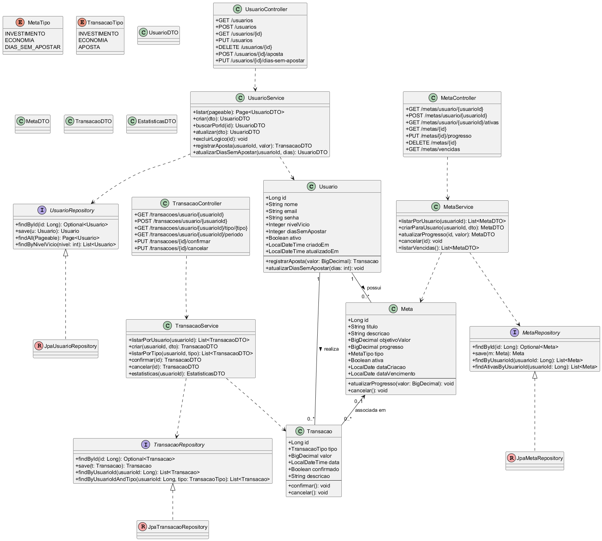

# XP Investimento - Auxílio contra Vício em Apostas

Sistema de auxílio para pessoas com vício em apostas, focado em incentivar investimentos como alternativa saudável. Desenvolvido em Spring Boot com arquitetura limpa e boas práticas.

## 👥 Integrantes da Equipe

| Nome | RM |
|------|-----|
| Rodrigo Fernandes Serafim | RM550816 |
| João Antonio Rihan | RM99656 |
| Adriano Lopes | RM98574 |
| Henrique de Brito | RM98831 |
| Rodrigo Lima | RM98326 |

O Workspace do Postman está disponível em: https://warped-resonance-873879.postman.co/workspace/safsa~7f4fc7d5-2d61-44c8-9818-fc1b0061248b/collection/29513449-b238ceaa-a682-4943-8559-85813c027049?action=share&source=copy-link&creator=29513449

## 🎯 Objetivo

Este aplicativo tem como objetivo ajudar pessoas que sofrem com vício em apostas, oferecendo:
- Controle e monitoramento de gastos com apostas
- Definição de metas de investimento
- Acompanhamento do progresso financeiro
- Estatísticas e relatórios para conscientização
- Sistema de recompensas baseado em dias sem apostar

### Diagrama de Classes




## ✨ Funcionalidades

### 👤 Gestão de Usuários
- Cadastro completo com dados pessoais e nível de vício
- Controle de dias sem apostar
- Monitoramento de gastos com apostas
- Definição de metas de investimento mensal
- Exclusão lógica (marca como inativo)

### 🎯 Gestão de Metas
- Criação de metas personalizadas (investimento, economia, dias sem apostar)
- Acompanhamento do progresso em tempo real
- Notificações de metas vencidas
- Limite de 5 metas ativas por usuário
- Histórico completo de metas

### 💰 Gestão de Transações
- Registro de investimentos, economias e apostas
- Associação de transações com metas
- Validações de negócio para evitar apostas excessivas
- Relatórios por período
- Confirmação/cancelamento de transações

### 📊 Relatórios e Estatísticas
- Total de investimentos realizados
- Valor economizado vs gasto em apostas
- Dias consecutivos sem apostar
- Média de gastos com apostas
- Usuários que atingiram metas

## 🛠 Tecnologias Utilizadas

- **Java 21**
- **Spring Boot 3.5.4**
- **Spring Data JPA**
- **Spring Validation**
- **MySQL 8.0**
- **Flyway** (Migrações de banco)
- **Maven**
- **Lombok**
- **Bean Validation**

## 🚀 Como Executar

### 1. Pré-requisitos
- Java 21 ou superior
- MySQL 8.0 ou superior
- Maven 3.6 ou superior

### 2. Clone o Repositório
```bash
git clone https://github.com/joaorihan/ReInveste-API.git
cd ReInveste-API
```

### 3. Configure o Banco de Dados

#### 3.1. Instale e inicie o MySQL
Certifique-se de que o MySQL está rodando na sua máquina.

#### 3.2. Crie o banco de dados
```sql
CREATE DATABASE xp_investimento_auxilio;
```

#### 3.3. Configure as credenciais
Edite o arquivo `src/main/resources/application.properties` e ajuste as configurações do banco:

```properties
spring.datasource.url=jdbc:mysql://localhost/xp_investimento_auxilio
spring.datasource.username=root
spring.datasource.password=sua_senha_aqui
```

### 4. Execute o Projeto

#### Usando Maven
```bash
mvn spring-boot:run
```

### 5. Testando

A aplicação estará disponível em: **http://localhost:8080**

## 📚 Endpoints da API

### 👤 Usuários
| Método | Endpoint | Descrição |
|--------|----------|-----------|
| `GET` | `/usuarios` | Listar usuários (paginado) |
| `POST` | `/usuarios` | Cadastrar usuário |
| `GET` | `/usuarios/{id}` | Buscar usuário por ID |
| `PUT` | `/usuarios` | Atualizar usuário |
| `DELETE` | `/usuarios/{id}` | Excluir usuário (lógico) |
| `POST` | `/usuarios/{id}/aposta` | Registrar aposta |
| `PUT` | `/usuarios/{id}/dias-sem-apostar` | Atualizar dias sem apostar |
| `GET` | `/usuarios/meta-alcancada` | Usuários com meta alcançada |
| `GET` | `/usuarios/nivel-vicio/{nivel}` | Buscar por nível de vício |
| `GET` | `/usuarios/estatisticas/sem-apostar` | Contar usuários sem apostar |
| `GET` | `/usuarios/estatisticas/media-gasto-apostas` | Média de gastos |

### 🎯 Metas
| Método | Endpoint | Descrição |
|--------|----------|-----------|
| `GET` | `/metas/usuario/{usuarioId}` | Listar metas do usuário |
| `POST` | `/metas/usuario/{usuarioId}` | Criar meta para usuário |
| `GET` | `/metas/usuario/{usuarioId}/ativas` | Metas ativas do usuário |
| `GET` | `/metas/{id}` | Buscar meta por ID |
| `PUT` | `/metas/{id}/progresso` | Atualizar progresso da meta |
| `DELETE` | `/metas/{id}` | Cancelar meta |
| `GET` | `/metas/vencidas` | Listar metas vencidas |
| `GET` | `/metas/usuario/{usuarioId}/concluidas/count` | Contar metas concluídas |

### 💰 Transações
| Método | Endpoint | Descrição |
|--------|----------|-----------|
| `GET` | `/transacoes/usuario/{usuarioId}` | Listar transações do usuário |
| `POST` | `/transacoes/usuario/{usuarioId}` | Registrar transação |
| `GET` | `/transacoes/usuario/{usuarioId}/tipo/{tipo}` | Transações por tipo |
| `GET` | `/transacoes/usuario/{usuarioId}/periodo` | Transações por período |
| `PUT` | `/transacoes/{id}/confirmar` | Confirmar transação |
| `PUT` | `/transacoes/{id}/cancelar` | Cancelar transação |
| `GET` | `/transacoes/usuario/{usuarioId}/estatisticas/investimentos` | Total investido |
| `GET` | `/transacoes/usuario/{usuarioId}/estatisticas/economias` | Total economizado |
| `GET` | `/transacoes/usuario/{usuarioId}/estatisticas/apostas` | Total em apostas |
| `GET` | `/transacoes/usuario/{usuarioId}/estatisticas/apostas-recentes` | Apostas recentes |

### 🏥 Health Check
| Método | Endpoint | Descrição |
|--------|----------|-----------|
| `GET` | `/health` | Status da aplicação |

## 📝 Exemplos de Uso

### Cadastrar Usuário
```bash
curl -X POST http://localhost:8080/usuarios \
  -H "Content-Type: application/json" \
  -d '{
    "nome": "João Silva",
    "email": "joao@email.com",
    "telefone": "11999999999",
    "cpf": "12345678901",
    "dataNascimento": "1990-01-15",
    "nivelVicio": "MEDIO",
    "valorGastoApostas": 1500.00,
    "metaInvestimentoMensal": 800.00,
    "dataUltimaAposta": "2024-01-10T14:30:00",
    "endereco": {
      "logradouro": "Rua das Flores, 123",
      "bairro": "Centro",
      "cidade": "São Paulo",
      "uf": "SP",
      "cep": "01234567"
    }
  }'
```

### Criar Meta de Investimento
```bash
curl -X POST http://localhost:8080/metas/usuario/1 \
  -H "Content-Type: application/json" \
  -d '{
    "tipoMeta": "INVESTIMENTO_MENSAL",
    "descricao": "Investir R$ 500 mensais em ações",
    "valorAlvo": 500.00,
    "dataInicio": "2024-02-01",
    "dataFim": "2024-12-31"
  }'
```

### Registrar Investimento
```bash
curl -X POST http://localhost:8080/transacoes/usuario/1 \
  -H "Content-Type: application/json" \
  -d '{
    "tipoTransacao": "INVESTIMENTO",
    "descricao": "Compra de ações da XP",
    "valor": 500.00,
    "dataTransacao": "2024-02-15T10:00:00",
    "observacoes": "Investimento mensal conforme meta",
    "metaId": 1
  }'
```

### Registrar Economia
```bash
curl -X POST http://localhost:8080/transacoes/usuario/1 \
  -H "Content-Type: application/json" \
  -d '{
    "tipoTransacao": "ECONOMIA",
    "descricao": "Valor que seria gasto em apostas",
    "valor": 200.00,
    "dataTransacao": "2024-02-15T15:30:00",
    "observacoes": "Economia de dinheiro que seria usado em apostas"
  }'
```

## 🔧 Configurações

### Banco de Dados
O projeto utiliza Flyway para controle de versão do banco de dados:
- **DDL Auto**: `validate` (não cria/dropa tabelas automaticamente)
- **Flyway**: Habilitado para aplicar migrações
- **Migrações**: Localizadas em `src/main/resources/db/migration/`

### Paginação
- **Tamanho padrão**: 10 registros por página
- **Ordenação**: Por nome (crescente) para usuários, por data de criação (decrescente) para metas e transações

### Validações de Negócio

#### Usuários
- Email e CPF únicos
- Data de nascimento no passado
- Nível de vício obrigatório

#### Metas
- Máximo 5 metas ativas por usuário
- Data de fim posterior à data de início
- Valor alvo maior que zero

#### Transações
- Valor maior que zero
- Investimentos devem estar associados a uma meta
- Validação de apostas excessivas em relação à meta de investimento

## 📊 Níveis de Vício

- **BAIXO**: Aposta ocasionalmente
- **MÉDIO**: Aposta regularmente  
- **ALTO**: Aposta frequentemente
- **CRÍTICO**: Aposta diariamente e tem problemas

## 🎯 Tipos de Meta

- **INVESTIMENTO_MENSAL**: Meta de investimento mensal
- **ECONOMIA_DIARIA**: Economia diária
- **DIAS_SEM_APOSTAR**: Meta de dias sem apostar
- **VALOR_ECONOMIZADO**: Valor específico a economizar
- **INVESTIMENTO_ESPECIFICO**: Investimento em ativo específico

## 💰 Tipos de Transação

- **INVESTIMENTO**: Aplicação em ativos financeiros
- **ECONOMIA**: Valor economizado (não gasto em apostas)
- **APOSTA**: Gasto com apostas (registrado para controle)
- **RESGATE**: Resgate de investimentos

## 🏗 Estrutura do Projeto

```
src/
├── main/
│   ├── java/
│   │   └── br/com/fiap3espg/spring_boot_project/
│   │       ├── controller/          # Controllers REST
│   │       ├── service/            # Lógica de negócio
│   │       ├── usuario/            # Entidades e DTOs de Usuário
│   │       ├── meta/               # Entidades e DTOs de Meta
│   │       ├── transacao/          # Entidades e DTOs de Transação
│   │       ├── endereco/           # Value Object de Endereço
│   │       ├── exception/          # Tratamento global de erros
│   │       └── SpringBootProject3EspgApplication.java
│   └── resources/
│       ├── application.properties  # Configurações
│       └── db/migration/          # Migrações do banco
└── test/                          # Testes
```
